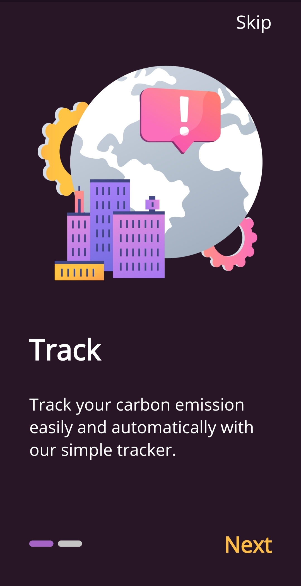

# Carbon Hero :

This is a flutter application that one can use for tracking his/her carbon footprints and check where he stands globally in terms of reduced carbon emission. Application invloves 6 activities that as a human we feel are common to all and have a impact on the carbon introduced by humans on daily basis. 

# Ranking criteria :
Ranking in this application is based on the points that a user has earned currently. The points are earned/lost is based on the fact that the emission of this person is less/more than the average.

# Google Signin :
Application uses google Signin to authenticate the user and askes for the details of his google contacts. Google contacts are mearly used to show the friend list of this user, so that he can compare his emission with respect to his friends. Any personal detials of the users are not accessible nor sharable to anyother user, so the application is safe in terms of privacy of users.

# Future Prospects :
Application once starts having good users and active users then there are some futue prospects we feel we can add to this application.
    1. Monthly Carbon Challenges - Monthly Challenges for users to keep emission below this value
    2. Top 5 users will earn masvie prices.
    3. Users can earn coupons and digital cash pricies if they reach certain goals.

Application idea is mainly webbed around the fact that the users can be stipulated to reduce carbon emission by complelling them to compete with one another and getting rewards at the end of it.

